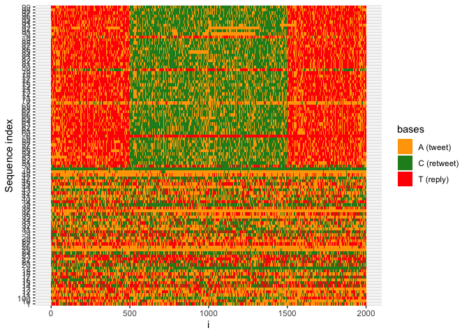

DigitalDNA-Rpackage
================
WAFI-CNR
01/09/2019

## Installation

``` r
install.packages("devtools", repos = "http://cran.us.r-project.org")
library(devtools)
devtools::install_github("WAFI-CNR/ddna-rpackage")
library(ddna)
```

## How to use

You can also embed plots, for example:

``` r
df <- sequence_tweets_from_file("timelines.json")
str(df)
```

    ## 'data.frame':    6 obs. of  2 variables:
    ##  $ user_id: Factor w/ 6 levels "1135017996","22834067",..: 5 3 2 4 6 1
    ##  $ seq    : Factor w/ 6 levels "AAAAAAAAAAACAAACCAAAACAAAAAAAAAAAAAATAATAAATTAAAAAATCAAAACAAACAAAAAAACAAAACAACAAAACAACACAAAATACAAAACAAACCCCAACA"| __truncated__,..: 6 3 5 2 1 4

or you can upload a CSV with already encoded DNA

``` r
df <- read.csv2("italian_retweets_users_sequences_new.csv", sep = ",")
str(df)
```

# Plot Bases distribution

``` r
plot_bases_distribution(df, dnacol = 3)
```

<!-- -->

## Plot interseq entropy

You can pass the column in which there is the DNA sequence (default=2)

``` r
plot_interseq(df, dnacol = 3)
```

<!-- -->

## Intraseq Entropy plot

``` r
plot_intraseq(df, dnacol = 3)
```

<!-- --> \# lcs plot

``` r
lcs_plot(df, threshold = "auto", window = 10)
```

<!-- --><!-- -->

# Detection bots

``` r
bots = predict_bots(df, threshold = "auto", window = 10)
```

    ## bots
    ## FALSE  TRUE 
    ##   454   284

## Plot Sequence Color

``` r
plot_sequences_by_color(df, dnacol = 3)
```

<!-- -->
