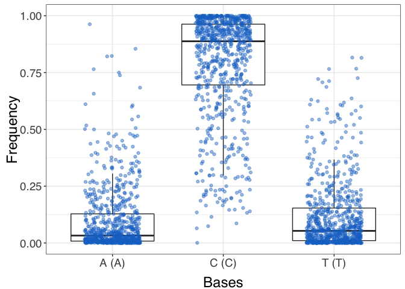

DigitalDNA-Rpackage
================
WAFI-CNR
01/09/2019

## Installation

``` r
install.packages("devtools", repos = "http://cran.us.r-project.org")
library(devtools)
devtools::install_github("WAFI-CNR/ddna-rpackage")
```

## How to use

The “sequence\_tweets\_from\_file” function call the Python function
“digitaldna.TwitterDDNASequencer” and codifies json timeline according
to three type of alphabets. Default alphabet “b3\_type” adopts: (A) for
tweets; (C) for replies; and (T) for retweets. More information on
alphabets here:
<https://wafi-cnr.github.io/ddna/stable/generated/digitaldna.TwitterDDNASequencer.html>

``` r
library(ddna)
df <- sequence_tweets_from_file("timelines.json", alphabet="b3_type")
str(df)
```

    ## 'data.frame':    6 obs. of  2 variables:
    ##  $ user_id: Factor w/ 6 levels "1135017996","22834067",..: 5 3 2 4 6 1
    ##  $ seq    : Factor w/ 6 levels "AAAAAAAAAAACAAACCAAAACAAAAAAAAAAAAAATAATAAATTAAAAAATCAAAACAAACAAAAAAACAAAACAACAAAACAACACAAAATACAAAACAAACCCCAACA"| __truncated__,..: 6 3 5 2 1 4

The package allows you to upload a CSV with already encoded DNA

``` r
df <- read.csv2("italian_retweets_users_sequences_new.csv", sep = ",")
str(df)
```

# Plot Bases distribution

It is possible to observe the distribution of each base of the chosen
alphabet. For each base it will be plotted a boxplot. The function
accepts as a parameter the index of the dataframe column of the codified
timeline (default 3).

``` r
plot_bases_distribution(df, dnacol = 3)
```

<!-- -->

## Plot interseq entropy

This function produces a composite plot. On the left a boxplot
representing the distribution of the inter-sequence entropy (Shannon’s
Entropy of the letters in the same with same sequence index but in
different sequences). On the right a scatterplot of the entropies
ordered by sequence index. “You can pass”plot\_interseq" accept the
column index in which there is the DNA sequence as a parameter
(default=2).

``` r
plot_interseq(df, dnacol = 3)
```

<!-- -->

## Intrasequence Entropy plot

This function produces a box plot with a single box representing the
distribution of the intra-sequence entropies (the Shannon Entropy
computed over a single digital dna sequence).

``` r
plot_intraseq(df, dnacol = 3)
```

<!-- -->

# LCS plot

The lcs plot function compute the longest common sequences among DDNA
strings. It accepts as parameters a threshold and a window. Threshold
indicates possible bots accounts and it can be calculated on the lcs
curve derived and smoothed by a running mean (threshold = “auto”) or
assigned as a integer (threshold = x). Window parameter set the running
mean window (neighbourhood). The lcs lenght column must be labelled as
“dna”.

``` r
lcs_plot(df, threshold = "auto", window = 10)
```

<!-- --><!-- -->

# Bots detection

“predicts\_bots” produces a single column dataframe (logical) which
identifies possible bot accounts.

``` r
bots = predict_bots(df, threshold = "auto", window = 10)
```

    ## bots
    ## FALSE  TRUE 
    ##   454   284

## Plot Sequence Color

This function plots codified timelines colored according to the chosen
alphabet. Timelines are plotted in deacresing order according to their
length.

``` r
plot_sequences_by_color(df, dnacol = 3)
```

<!-- -->
